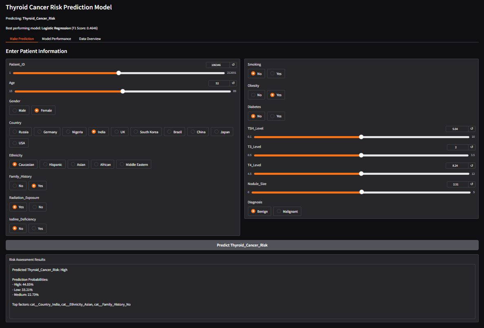
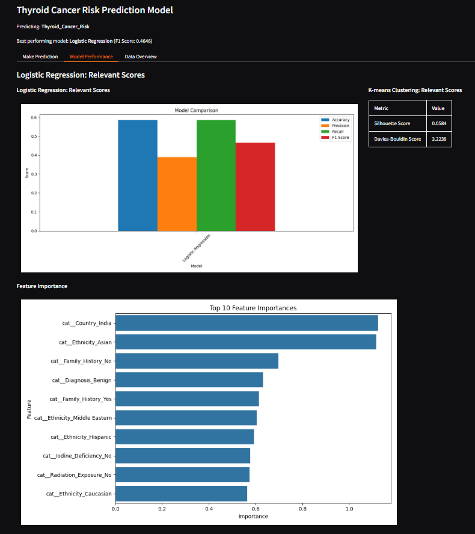
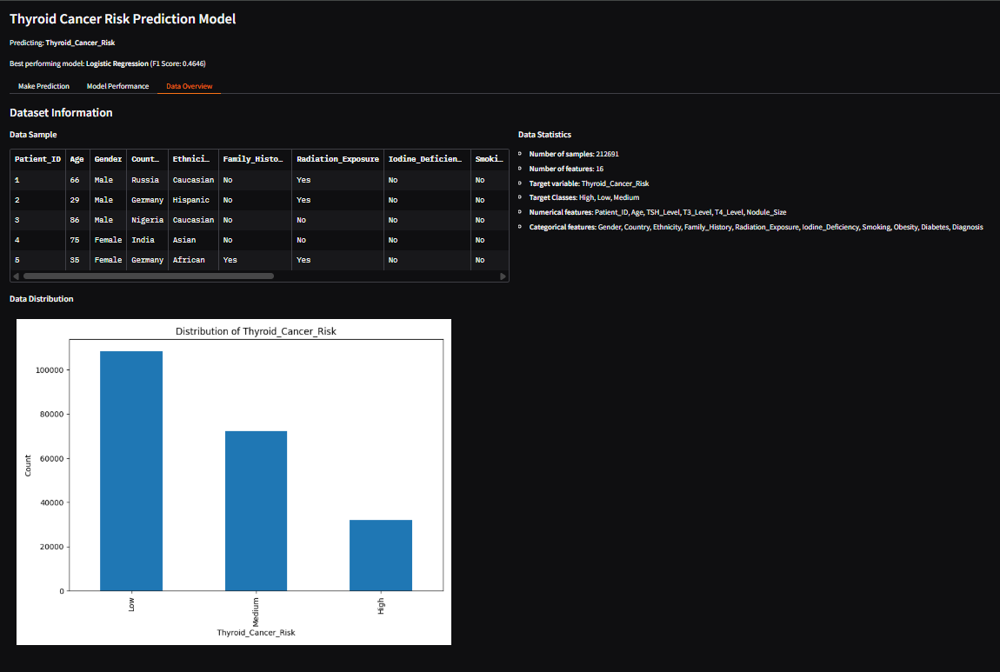

# Cancer-Risk-Predictor-

Please open the cancer_risk_assessment_FINALACTUALLY.ipynb file in Google Colab.

Once it has been opened, open thyroid_cancer_risk_data.csv. (It should automatically go to the /content folder. It must be there for the program to recognize/read the csv).

It may take up to 10 minutes to load all the cells, depending on your GPU. We recommend using Colab Pro (free with student email) for faster runtime.

Scroll down to the very bottom to see the data visualizations.

